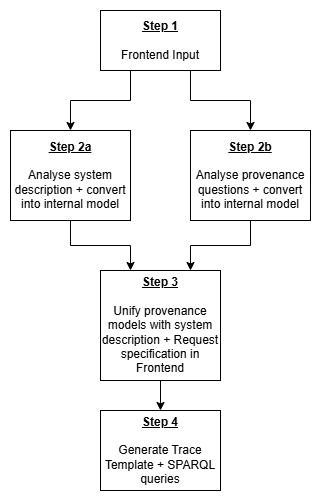

# Architecture

The **AI Auditing & Provenance Question Tool** is built as a modular, distributed system following a **microservice architecture**. Each service is responsible for a distinct concern in the pipeline, allowing for independent development, deployment, and scaling.

## Workflow



## Overview

The system consists of the following services:

### [Frontend](components/frontend.md)

- **Tech:** Angular + Bootstrap
- **Role:** Provides an interactive user interface to input natural language questions and the AI system description, unify ambiguities in questions, and download the generated trace templates and sparql queries.
- **Port:** `5503`

### [AI System Analyzer](components/ai-system-analyzer-service.md)

- **Tech:** Java + Apache Jena
- **Role:** Parses and analyzes the internal structure of AI systems and converts them into an internal JSON representation based on semantic web technologies.
- **Port:** `5500`

### [PQ Analyzer](components/pq-analyzer-service.md)

- **Tech:** Python
- **Role:** Handles natural language processing of provenance-related questions, simplifying them and mapping them to ontology-based queries (e.g., PROV-O).
- **Port:** `5501`

### [Unification Generation Service](components/unification-generation-service.md)

- **Tech:** Python
- **Role:** Merges and enriches inputs from the AI analyzer and PQ analyzer, creating unified graph structures for the director to consume.
- **Port:** `5504`

### [Director Managing Service](components/director-managing-service.md)

- **Tech:** Java
- **Role:** Acts as the central coordinator. Receives requests from the frontend, orchestrates communication between all analysis services, and returns structured answers.
- **Port:** `5502`

---

## Deployment with Docker Compose

All services are containerized and orchestrated via Docker Compose:

```yaml
services:
  unification-generation-service:
    build: ./unification-generation-service
    ports:
      - "5504:5504"

  ai-system-analyzer-service:
    build: ./ai-system-analyzer-service
    ports:
      - "5500:5500"

  pq-analyzer-service:
    build: ./pq-analyzer-service
    ports:
      - "5501:5501"

  director-managing-service:
    build: ./director-managing-service
    ports:
      - "5502:5502"
    depends_on:
      - ai-system-analyzer-service
      - pq-analyzer-service
      - unification-generation-service
    environment:
      - mode=prod

  frontend:
    build: ./frontend
    ports:
      - "5503:80"
    depends_on:
      - director-managing-service
    environment:
      - mode=prod
```

---

## Distributed Microservice Benefits

This architecture provides:

- **Scalability**: Each component can be scaled independently based on load.
- **Separation of Concerns**: Services are decoupled and focused on specific tasks.
- **Technology Flexibility**: Services use the best-suited languages (Java for semantic reasoning and managing transactions, Python for NLP, Angular for UI).
- **Robustness**: Failures in one service do not crash the entire system.
