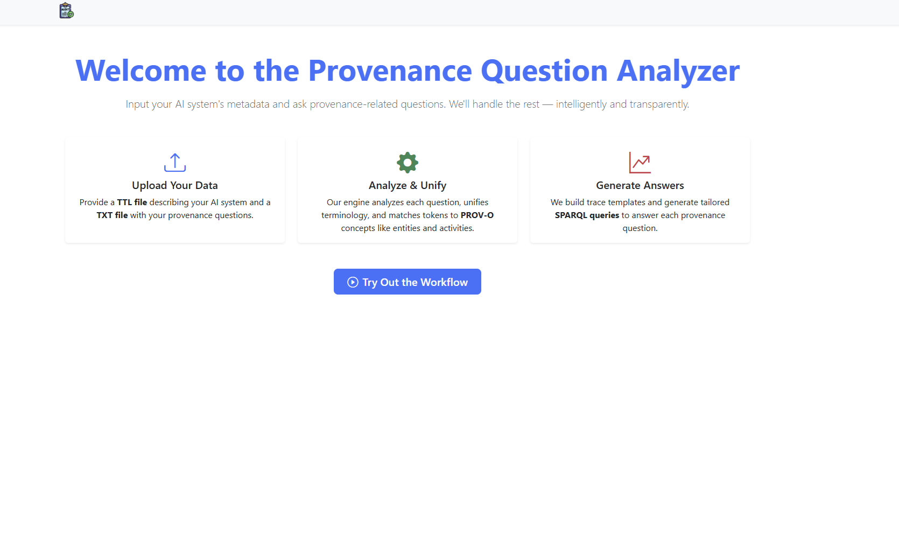
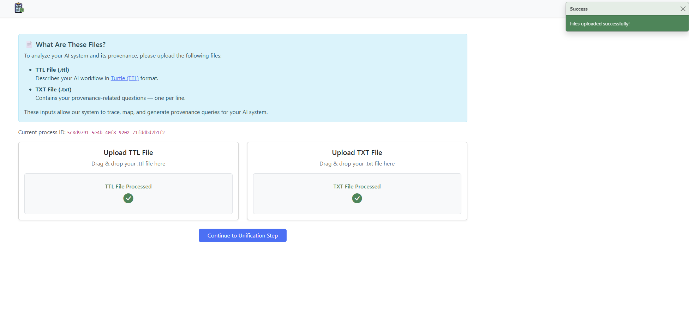
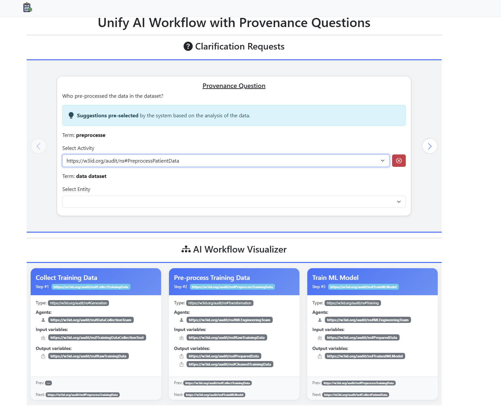
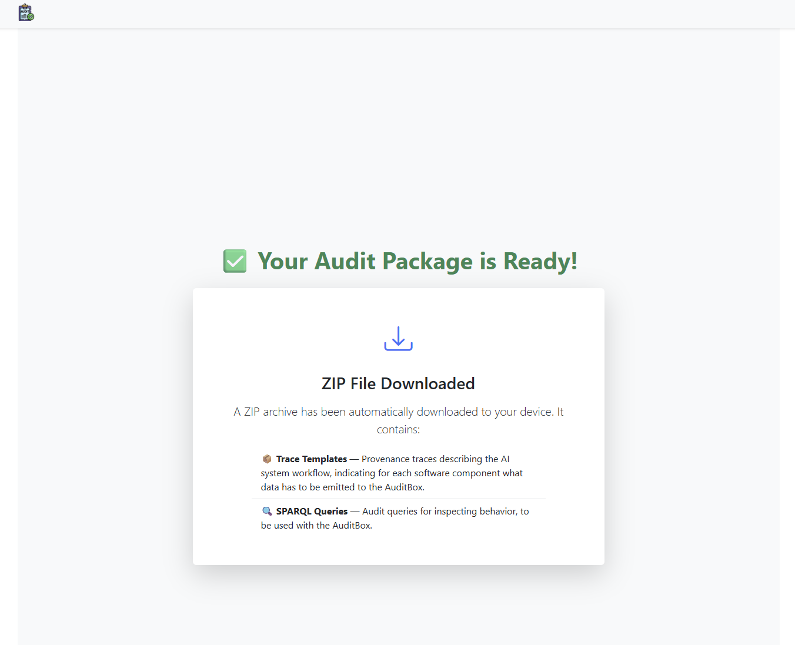

# Frontend Service

The **Frontend** is the primary user interface for the AI Auditing & Provenance Question Tool. It provides an interactive, guided experience for users to upload their system descriptions, clarify their natural language questions, and receive the final, actionable outputs.

- **Technology:** Angular (18.2.11)
- **Styling:** Bootstrap & ng-bootstrap (5.2.3)
- **Port:** `80` (mapped to `5503` by Docker Compose)

In order to start it locally for development purposes or decoupled usage from the remaining services:

- `npm install`
- `ng serve`

## User Workflow

The user interface guides the user through a simple, three-step process to transform their auditing needs into formal artifacts.

### Step 1: Upload Inputs



The journey begins on the "Start Workflow" page. The user is presented with two designated drag-and-drop areas to provide the necessary inputs.

- **AI System Description:** A Turtle (`.ttl`) file defining the AI system's workflow, components, and actors.
- **Auditing Questions:** A plain text (`.txt`) file containing a list of natural language questions for the audit.



?> The frontend only communicates with the **Director Managing Service**, which acts as a central orchestrator. Once the files are uploaded, they are sent to the Director, which initiates the backend analysis pipeline. The user waits until this initial processing is complete before proceeding.

### Step 2: Clarify Ambiguities

This is the core interactive step of the tool. Because natural language can be ambiguous, this screen allows the user to map their questions to the formal concepts defined in their AI system description.

The interface presents each question that requires clarification as a **swipeable card**. For each card, the user:

1.  **Reviews the Question:** The original question is displayed at the top.
2.  **Selects a Mapping:** The user selects the best-matching `activity` and `entity` from the AI system graph that corresponds to the terms in their question.
3.  **Refines the Trace:** Optionally, the user can select specific fields to be included in the generated trace template.

To aid this process, a **visual representation of the AI system workflow** is displayed below the cards, showing all the steps, variables, and agents from the uploaded `.ttl` file.



### Step 3: Download the Results

Once the user has swiped through and resolved all clarification cards, they are taken to the final results page.

An information box confirms that the process is complete, and a **ZIP archive is automatically downloaded** to their browser.



---

## Understanding the Output Archive

The downloaded `output.zip` file contains the generated auditing artifacts, neatly organized into two folders:

```
output.zip
├── sparql/
│   ├── query_1.sparql
│   └── query_2.sparql
└── traces/
    ├── trace_template_1.json
    └── trace_template_2.json
```

- **`/sparql`**: This folder contains the formalized **SPARQL queries**, with each `.sparql` file corresponding to one of the user's original questions.
- **`/traces`**: This folder contains **JSON trace templates**. These templates can be used to validate the execution trace of the AI system in the AuditBox.

---

## For Developers (Living Documentation)

This section provides technical details for developers working on the frontend codebase.

### Development & Build Setup

#### Local Development

To run the frontend service locally for development without the rest of the microservices, navigate to the `frontend/` directory and run:

```bash
# Install dependencies
npm install

# Start the local development server
ng serve
```

The application will be available at `http://localhost:4200`.

#### Docker Build Process

The frontend is containerized using a multi-stage `Dockerfile` for an optimized and lightweight production image.

1.  **Build Stage:** A `node:20` image is used to install all `npm` dependencies and build the Angular application. This stage compiles the TypeScript code into static HTML, CSS, and JavaScript files.
2.  **Production Stage:** A lightweight `nginx:stable-alpine` image is used as the final base. The static files generated in the build stage are copied into the NGINX web server directory. A custom `nginx.conf` file is included to properly handle routing for the single-page application.

<details>
<summary><b>Click to see the full Dockerfile</b></summary>

```dockerfile
# Stage 1: Build the Angular application
FROM node:20 AS build-stage
WORKDIR /app
COPY package*.json ./
RUN npm install
COPY . .
RUN npm run build --prod

# Stage 2: Serve the application from NGINX
FROM nginx:stable-alpine AS production-stage
COPY --from=build-stage /app/dist/frontend/ /usr/share/nginx/html
COPY nginx.conf /etc/nginx/conf.d/default.conf
EXPOSE 80

CMD ["nginx", "-g", "daemon off;"]
```

</details>

### Folder Structure

The application source code in `frontend/src/app` is organized as follows:

- **`/components/pages`**: Contains the main Angular components that represent a full page view (e.g., `upload-page`, `clarification-page`).
- **`/components/shared`**: Contains reusable components used across different pages (e.g., the workflow graph visualizer, a custom button).
- **`/dtos`**: Contains the TypeScript `interface` definitions for all Data Transfer Objects used to communicate with the backend. This is crucial for type safety.
- **`/enums`**: Contains TypeScript `enum` definitions for constants used within the application.
- **`/services`**: Contains the Angular services. This includes the primary service for communicating with the Director backend and a `ToastService` for displaying notifications.

### Component Interaction & State Management

!> The frontend components are decoupled from each other. Data is passed between the main page components (e.g., from the upload page to the clarification page) using the **Angular Router state**.

This approach avoids creating a complex, shared state management service and leverages Angular's built-in capabilities for managing transient data during navigation.

### Core Data Structures

The interaction on the clarification page is driven by a single, crucial data object received from the backend. The structure is defined in the `UnificationClarificationResponseDto`.

<details>
<summary><b>Click to see the key DTO interfaces</b></summary>

```typescript
// The main object passed from the upload to the clarification page
export interface UnificationClarificationResponseDto {
  workflow: WorkflowDTO; // Used to render the visual workflow graph
  unificationClarificationResponse: UnificationClarificationDto; // Used to populate the clarification cards
}

// Defines the data for the clarification cards
export interface UnificationClarificationDto {
  options: PossibleActivitiyDto[];
  mappingSuggestions: MappingItemDto[];
  requestId: string;
}

// Defines the data for rendering the visual workflow graph
export interface WorkflowDTO {
  workflowSteps: WorkflowStepDTO[];
  workflowAgents: WorkflowAgentDTO[];
  workflowVariables: WorkflowVariableDTO[];
}

// --- Other supporting interfaces ---

export interface MappingItemDto {
  question: string;
  mapping?: MappingSuggestionDto;
}

export interface MappingSuggestionDto {
  firstTerm: string;
  secondTerm: string;
  mappings: PossibleActivitiyDto[];
}

export interface PossibleActivitiyDto {
  activity: string;
  entities: string[][];
}
// ... and more detailed DTOs for steps, agents, and variables.
```

</details>
