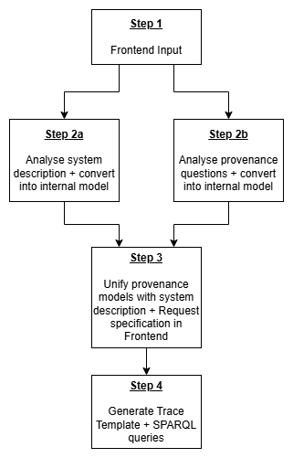

# <u>Workflow</u>

## Step 1: Frontend input

Enter the TTL file for the system description. \
Enter the list of provenance questions (1 per line, txt file).

## Step 2a: Analyse/process system description

The system description is converted into a inner model, using JAVA classes

## Step 2b: Parse provenance questions into internal model

Each provenance question is analyzed using a python microservice. Each questions runs through following stages:

- Natural Language Analysis of the PQ
- Linguistic Analysis of the PQ
- Rewrite the PQ
- Formalization of the PQ
- Mapping to PROV-O

Each provenance question is converted into a JSON object, with additional information about the structure, the different words roles, the mappings...

## Step 3: Unify provisory trace template with model

The trace template to be requested are compared to the internal model of the AI system. For ambiguous designation of terms (dataset), specification from the user is required using a dropdown with potential options to select from.

The AI system is represented in that step in a visual manner.

## Step 4: Generate final trace template + SPARQL queries + Mapping files

From the info, concrete trace templates for each step of the AI system + SPARQL queries are generated and returned together as a ZIP file.
